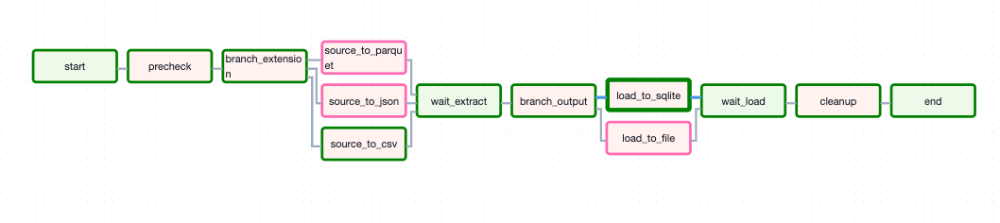
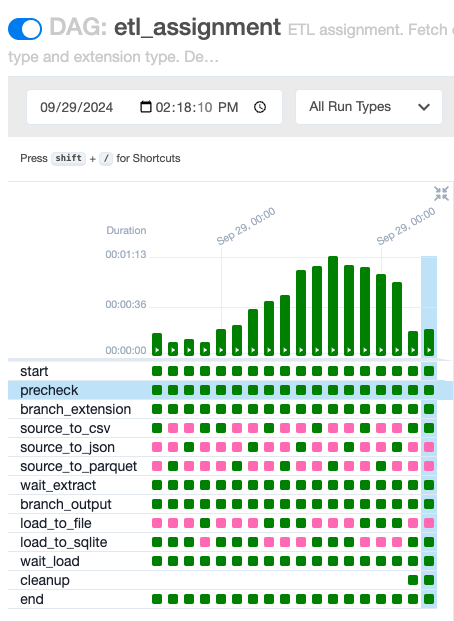
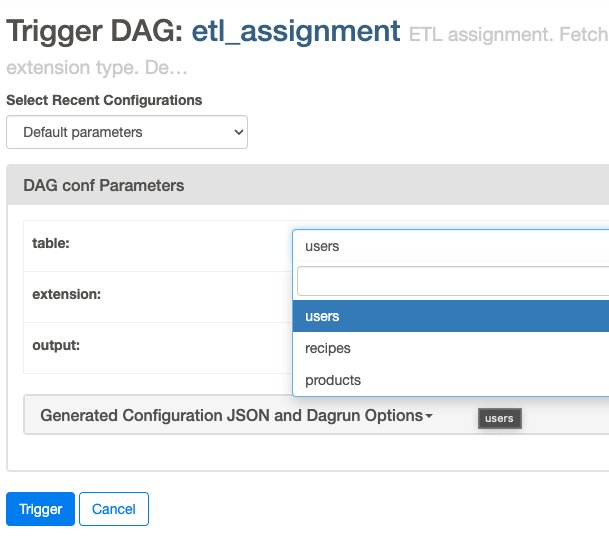
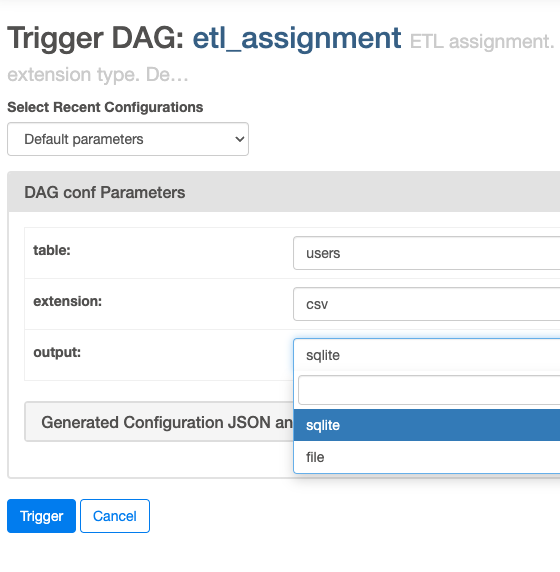
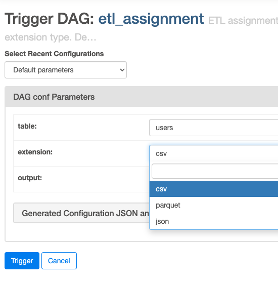
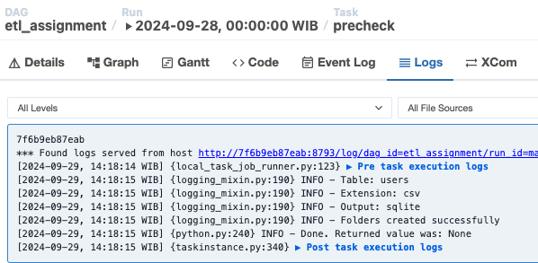
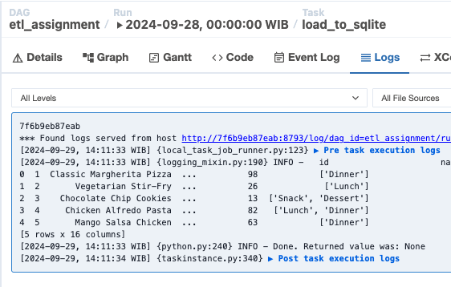
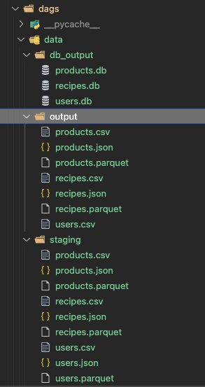

## ETL Assignment: Data Pipeline with Airflow

This Airflow DAG implements an ETL pipeline to extract data from a public API, transform it, and load it into both a SQLite database and a file.

**Visualizations:**

* **DAG Graph:** 
* **DAG Runs:** 
* **Table Configs:** 
* **Output Configs:** 
* **Extension Configs:** 
* **Precheck Logs:** 
* **Load to DB logs:** 
* **Output Directory Structure:** 

**Key Features:**

* **Dynamic Data Source:** The DAG fetches data from the `dummyjson.com` API based on the specified table name (`users`, `recipes`, or `products`).
* **Flexible Output:** The DAG supports different output formats (`csv`, `parquet`, `json`) and output destinations (SQLite database or file).
* **Parameterization:** The DAG uses Airflow parameters to allow users to customize the table name, output format, and output destination.
* **Data Transformation:** The DAG flattens the JSON data from the API using the `flatten_dict` library.
* **Error Handling:** The DAG includes checks to ensure that the specified table name, output format, and output destination are valid.
* **Cleanup:** The DAG cleans up the staging folder after the ETL process is complete.

**DAG Structure:**

1. **Start:** An `EmptyOperator` that marks the beginning of the DAG.
2. **Precheck:** A `PythonOperator` that validates the user-provided parameters and creates necessary folders.
3. **Branch Extension:** A `BranchPythonOperator` that determines the data transformation based on the specified output format.
4. **Source to [Format]:**  `PythonOperators` that extract data from the API and transform it into the specified format (`csv`, `json`, or `parquet`).
5. **Wait Extract:** An `EmptyOperator` that waits for the data transformation tasks to complete.
6. **Branch Output:** A `BranchPythonOperator` that determines the output destination based on the specified output type.
7. **Load to [Destination]:** `PythonOperators` that load the transformed data into the specified destination (SQLite database or file).
8. **Wait Load:** An `EmptyOperator` that waits for the data loading tasks to complete.
9. **Cleanup:** A `PythonOperator` that cleans up the staging folder.
10. **End:** An `EmptyOperator` that marks the end of the DAG.

**Running the DAG:**

To run the DAG, you can use the Airflow UI or the command line. You can also modify the parameters in the DAG definition to customize the ETL process.

**Example Usage:**

To extract data from the `users` table, save it as a CSV file, and load it into a SQLite database, you can set the following parameters:

```
table: users
extension: csv
output: sqlite
```

**Note:**

This DAG is a basic example of an ETL pipeline using Airflow. You can extend it to include more complex data transformations, error handling, and monitoring.
