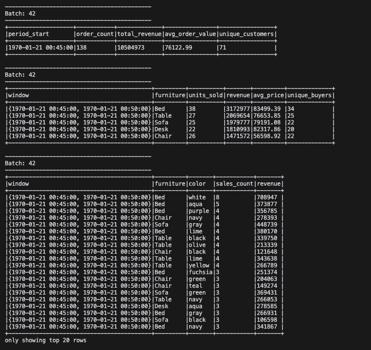

# Spark Streaming day 25 with Kafka

## Overview

This project demonstrates a real-time data processing pipeline using Apache Kafka and Apache Spark. The pipeline consists of a Kafka producer that generates synthetic data and a Spark consumer that processes this data in real-time.

## Components

### 1. Kafka Producer ([event_producer.py](dibimbing_spark_airflow/scripts/event_producer.py))

- Generates synthetic data for a furniture store, including order details such as furniture type, color, price, and timestamp.
- Sends data to a specified Kafka topic at regular intervals (every 3 seconds).

### 2. Spark Consumer ([spark-event-consumer.py](dibimbing_spark_airflow/spark-scripts/spark-event-consumer.py))

- Listens to the Kafka topic for incoming data.
- Processes the data to provide real-time analytics, including:
  - Overall sales performance
  - Product-specific metrics
  - Color preferences
  - Customer behavior
- Outputs results to the console in 5-minute windows, updating every 10 seconds.

### Consumer Result



## Setup and Execution

### Prerequisites

- Docker and Docker Compose installed on your machine.

### Step-by-Step Guide

1. **Clone the Repository**

   ```bash
   git clone <repository-url>
   cd dibimbing_spark_airflow
   ```

2. **Build Docker Images**
   Use the Makefile to build the necessary Docker images.

   ```bash
   make docker-build
   ```

3. **Start Kafka and Spark Services**
   Use Docker Compose to start the Kafka and Spark services.

   ```bash
   docker-compose -f docker/docker-compose-kafka.yml up -d
   docker-compose -f docker/docker-compose-spark.yml up -d
   ```

4. **Run the Kafka Producer**
   Execute the Kafka producer script to start generating data.

   ```bash
   python scripts/event_producer.py
   ```

5. **Run the Spark Consumer**
   Execute the Spark consumer script to start processing data.

   ```bash
   spark-submit spark-scripts/spark-event-consumer.py
   ```

6. **Monitor the Output**
   - The console will display real-time analytics from the Spark consumer.
   - Check the logs for any errors or insights.

## Additional Resources

- **Docker Compose Files**

  - [docker-compose-kafka.yml](dibimbing_spark_airflow/docker/docker-compose-kafka.yml): Configures Kafka services.
  - [docker-compose-spark.yml](dibimbing_spark_airflow/docker/docker-compose-spark.yml): Configures Spark services.

- **Makefile**
  - Provides commands to build Docker images and manage services.

## Conclusion

This assignment showcases the integration of Kafka and Spark for real-time data processing. By following the setup guide, you can simulate a real-time analytics pipeline and gain insights into streaming data.

---

Reference from seceng with some improvement
